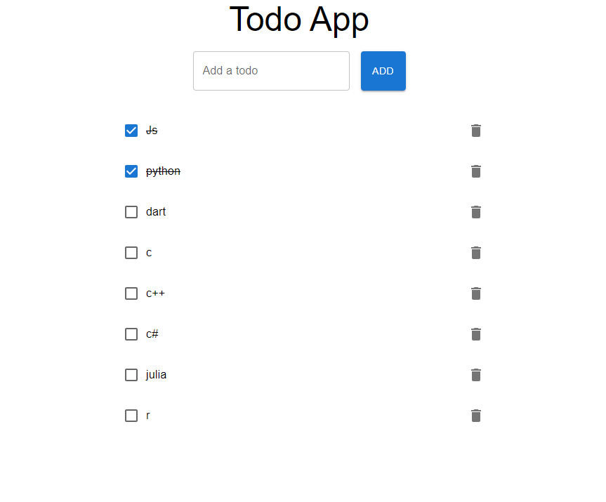

# Stylish Todo App Built with React.js and Material-UI

A modern and stylish Todo application developed using React.js and Material-UI (MUI). This app allows users to add, complete, and delete tasks with a sleek and responsive user interface enhanced by custom styling and animations.

## Screenshots



## Features

- **Add Todos:** Quickly add new tasks with an enlarged input field for better usability.
- **Complete Todos:** Mark tasks as complete or incomplete with a simple checkbox.
- **Delete Todos:** Remove tasks that are no longer needed.
- **Responsive Design:** The app looks great on all devices, from mobile phones to desktop screens.
- **Material-UI Components:** Utilizes MUI for consistent and modern UI elements.
- **Custom Styling:** Enhanced styles and animations for an improved user experience.

## Installation and Usage

1. **Clone the repository**

   ```bash
   git clone https://github.com/baberibrar/react-stylish-todo-app.git
